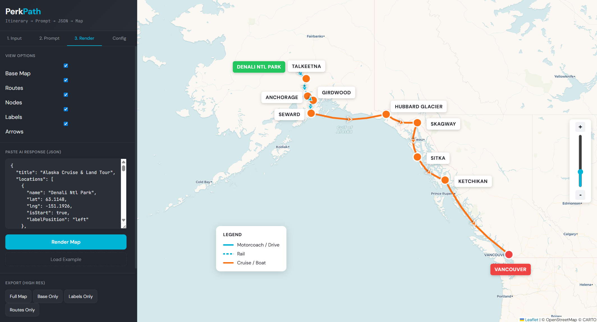
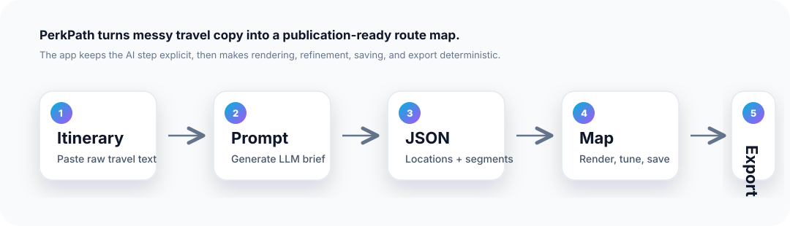

# PerkPath by TravelPerks

PerkPath turns a plain-language itinerary into a polished, export-ready route map. Paste an itinerary, generate an AI prompt, paste back structured JSON, and fine-tune the final visual with marketer-friendly controls for labels, routes, colors, legends, saved views, and high-resolution exports.

It is designed for teams who need to move quickly from travel narrative to visual storytelling: tour builders, campaign marketers, sales enablement teams, itinerary designers, and product teams prototyping AI-assisted workflows.



## Why it exists

Great travel experiences are spatial, but most itinerary content starts as unstructured text: flights, transfers, cruises, rail segments, stops, and overnight locations. Turning that into a beautiful map usually means manual design work, fragile spreadsheets, or one-off graphics.

PerkPath compresses that workflow into a repeatable product loop:

1. Start with itinerary text.
2. Generate a structured AI extraction prompt.
3. Ask an LLM to return clean map JSON.
4. Render the itinerary as an interactive map.
5. Adjust the visual system until it is presentation-ready.
6. Export high-resolution assets for marketing, sales, or client-facing materials.



## What it does

PerkPath is not just a map renderer. It is an end-to-end workflow for converting messy itinerary text into controlled, brandable map outputs.

### AI-assisted itinerary structuring

The app creates a purpose-built prompt that asks an AI model to extract locations, coordinates, transport modes, and route segments from raw itinerary text. This keeps the model focused on producing a predictable schema instead of a prose summary.

### Interactive route rendering

PerkPath renders structured itinerary data on a Leaflet map using curved route geometry, directional arrows, transport-specific styling, node markers, and labels. It supports common travel movement types including flights, rail, driving, and cruises.

### Design controls for non-engineers

The interface exposes practical visual controls: base map visibility, route visibility, node visibility, label visibility, arrows, color presets, label styling, node size, arrow size, and legend scale. The goal is to let a marketer or itinerary specialist make the map look right without touching code.

### Manual polish where automation falls short

Automated map layouts are useful, but the last 10% often requires human judgment. PerkPath supports draggable labels, leader lines when labels are moved away from their nodes, draggable legends, and selective hiding for visual cleanup.

### Saved views and reusable outputs

Rendered maps can be saved as views, reloaded, imported, exported, and shared as JSON. This makes the workflow repeatable across trips, campaigns, and design iterations.

### High-resolution export

PerkPath can export the full map or individual layers such as base map, labels, and routes. This makes it easier to produce assets for decks, landing pages, brochures, social posts, and internal reviews.

## Product instincts behind the build

PerkPath demonstrates a few principles we value in product work:

- **Meet users where the work starts.** Itineraries usually begin as text, not clean datasets.
- **Use AI as a workflow accelerator, not a black box.** The app separates prompt generation, JSON review, and map rendering so humans stay in control.
- **Make the output editable.** The map is not treated as a final answer; it is treated as a draft that can be refined.
- **Design for real production needs.** Export modes, saved views, layer toggles, and styling controls reflect the messy handoff between product, marketing, sales, and design.
- **Keep the technical architecture legible.** The codebase separates geospatial math, rendering, layout, configuration, storage, and UI behavior into focused modules.

## Core workflow

### 1. Paste an itinerary

Add raw itinerary text in the **Input** tab. This can be a multi-day travel plan, a cruise-and-land journey, a regional tour, or a sequence of city stops.

### 2. Generate the AI prompt

Click **Generate AI Prompt**. PerkPath produces a structured prompt designed to get back map-ready JSON from an LLM.

### 3. Ask an AI model for JSON

Paste the generated prompt into ChatGPT, Claude, or another AI assistant. The expected response is a JSON object containing a trip title, locations, and route segments.

### 4. Render the map

Paste the JSON response into the **Render** tab and click **Render Map**. PerkPath plots the itinerary as an interactive route map.

### 5. Refine the visual

Use the configuration controls to adjust the look and feel. Drag labels, reposition the legend, toggle layers, and hide individual details as needed.

### 6. Export the result

Export a full map or specific layers for downstream marketing and presentation use.

## Feature highlights

| Area         | What PerkPath supports                                                               |
| ------------ | ------------------------------------------------------------------------------------ |
| Input        | Raw itinerary text, generated AI prompts, pasted JSON responses                      |
| Mapping      | Leaflet map rendering, location nodes, route segments, directional arrows            |
| Route design | Transport-specific colors and line styles for drive, rail, cruise, and flight        |
| Layout       | Label positioning, draggable labels, leader lines, draggable legend                  |
| Controls     | Layer toggles, color presets, label styling, node sizing, arrow sizing, legend scale |
| Persistence  | Saved views, imported views, exported view JSON                                      |
| Export       | Full map, base-only, labels-only, and routes-only exports                            |

## Tech stack

- **TypeScript** for maintainable application logic
- **Vite** for fast local development and production builds
- **Leaflet** for interactive web mapping
- **Turf.js** for geospatial calculations and route curves
- **html2canvas** for visual export workflows
- **Biome** for code checking and formatting

## Project structure

```text
perkpath/
├── docs/
│   ├── example.png
│   └── perkpath-flow.svg
├── public/
├── src/
│   ├── config.ts
│   ├── config-ui.ts
│   ├── export.ts
│   ├── geo.ts
│   ├── label-drag.ts
│   ├── layout.ts
│   ├── legend.ts
│   ├── map.ts
│   ├── map-draw.ts
│   ├── prompt.ts
│   ├── route-types-ui.ts
│   ├── types.ts
│   ├── view-manager.ts
│   └── view-storage.ts
├── index.html
├── package.json
├── tsconfig.json
└── vite.config.ts
```

## Local development

Install dependencies:

```bash
npm install
```

Run the development server:

```bash
npm run dev
```

Run checks:

```bash
npm run check
```

Build for production:

```bash
npm run build
```

Preview the production build:

```bash
npm run preview
```

## Deployment

The app is built as a static Vite site. The existing GitHub Actions workflow builds the project and publishes the `dist/` directory to Cloudflare Pages.

## Notes for future improvements

PerkPath already proves the core workflow. Natural next steps would include direct LLM integration, stronger JSON validation, route editing in the map canvas, brand preset management, and export templates sized for common marketing surfaces.

## License

Private / proprietary.
